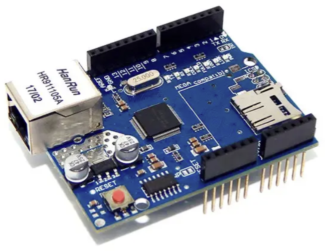

# ADuCM360-ArduinoLike
MIT Licensed* C++ Arduino-Like libraries to make ADuCM360 based boards more user friendly.

*All ported Arduino libraries are under the GNU Lesser General Public License. You can find the license in this repository (gpl_arduino_license.txt) or [here](https://github.com/arduino/Arduino/blob/master/license.txt).

NOTE: Everything was tested on the ADICUP360 board ONLY.

NOTE: These are not official Analog Devices libraries.
## Install
#### Stable
Go to the [releases page](https://github.com/MB3hel/ADuCM360-ArduinoLike/releases "Releases") and download the latest release. Copy the contents of the include directory into your project's include directory. Copy the contents of the src directory into your project's src directory.
#### Newest
Download or clone the repository. Copy the contents of the include directory into your project's include directory. Copy the contents of the src directory into your project's src directory.
## Use
- To use most libraries include the ArduinoLike.h file.
```cpp
#include "ArduinoLike.h"
```
- To use the Ethernet shield libraries inlude the same files as on the Arduino but add "ArduinoEthernet/"
```cpp
#include "ArduinoEthernet/Ethernet.h"
#include "ArduinoEthernet/EthernetUdp.h"
#include "ArduinoEthernet/utility/w5100.h"
//IPAddress and other dependencies are in "ArduinoEthernet/dependency"
#include "ArduinoEthernet/dependency/IPAddress.h"
```
### Timing
Timing library for delay and millis functions.
```cpp
delay(milliseconds)
millis()             //Time from timer start(board boot/reset)
```
### DIO
Arduino style digital input andoutput functions including:
```cpp
pinMode(bar, pin, mode)
digitalWrite(bar, pin, power)
digitalRead(bar, pin)
digitalToggle(bar, pin)
```
### Serial
Arduino style UART communication. Support print and println of char, char*, string, and int. It must be reconfigured every time before writing to a different UART port:
```cpp
serial.begin(B9600, PIN12);      //Configure for pins 1 and 2
serial.println("Test 1 and 2");
delay(10);                       //Allow data to send
serial.begin(B9600, PIN67);      //Configure for pins 6 and 7
serial.println("Test 6 and 7");
delay(10);
```
NOTE: serial is a lowercase 's' unlike the Arduino.
### Arduino W5100 Ethernet Shield (No SD card yet)

The actual ethernet shield library for the arduino was ported over. Everything should work as expected.

NOTE: Included files have "ArduinoEhternet/" in front of the file name used for the arduino (without the quotes).

NOTE: I plan to add SD card support soon.